# SQL info #

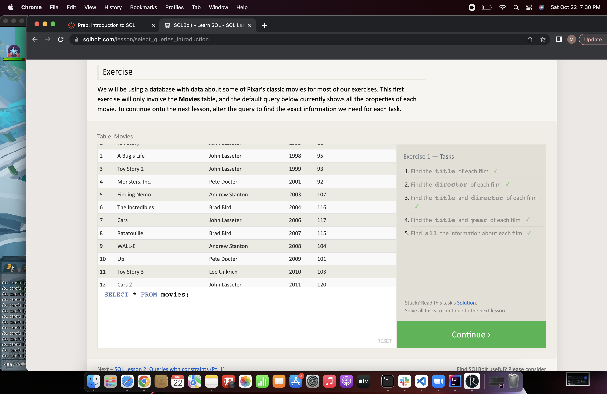
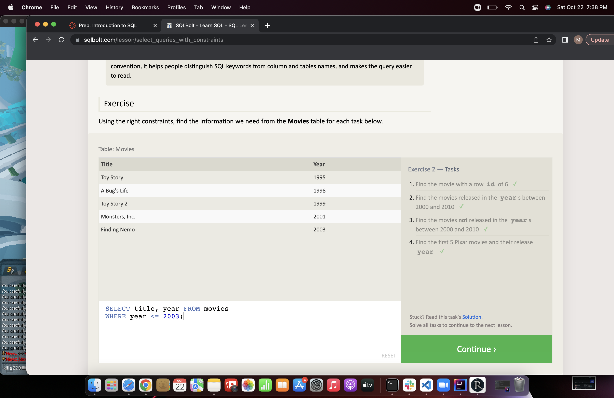
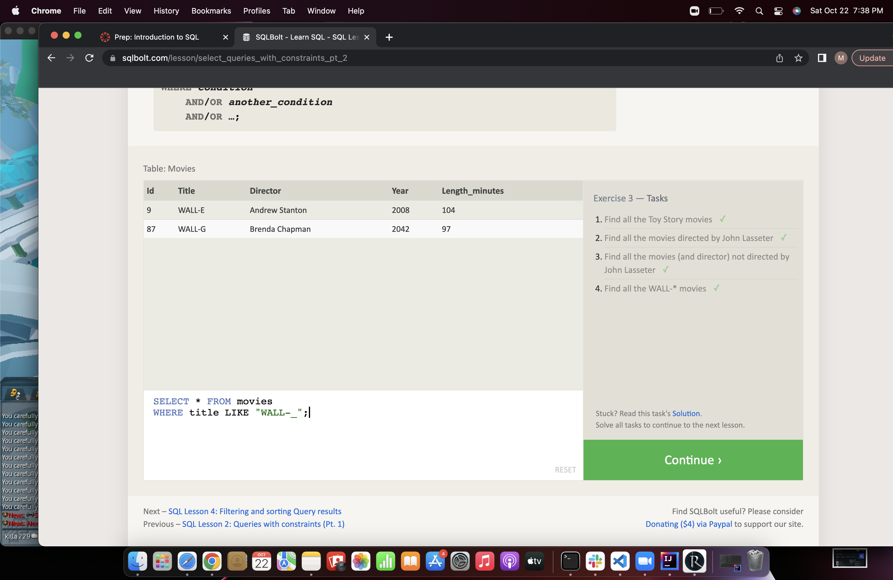
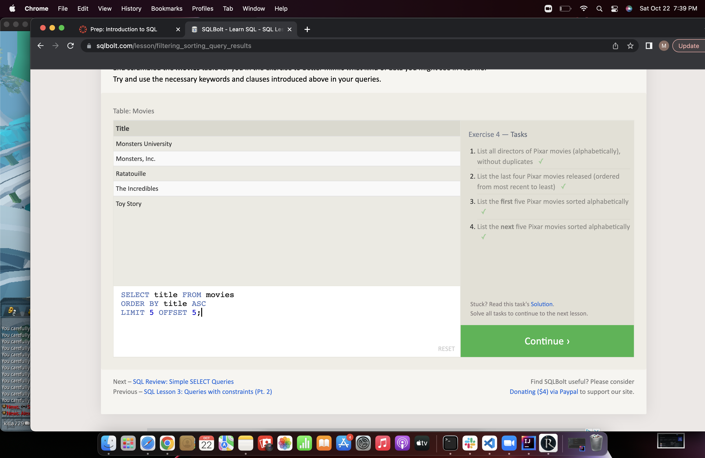
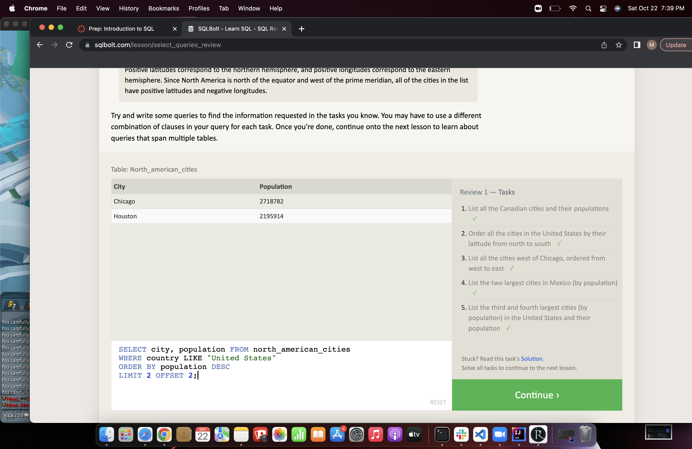
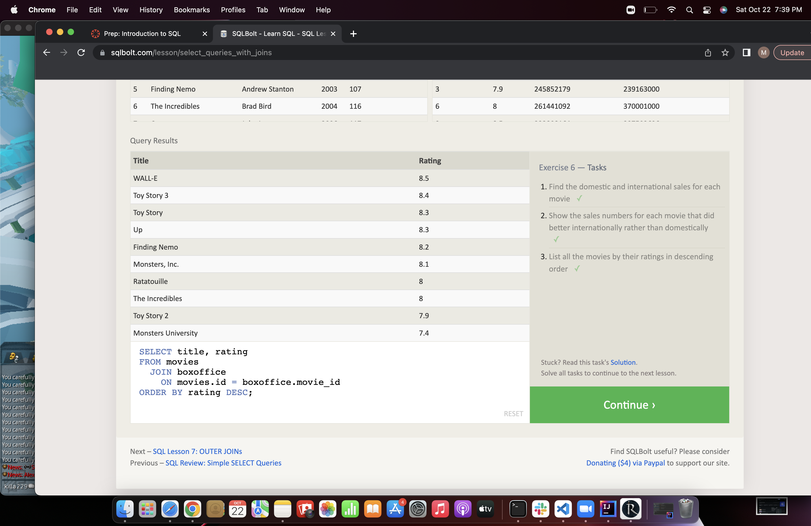
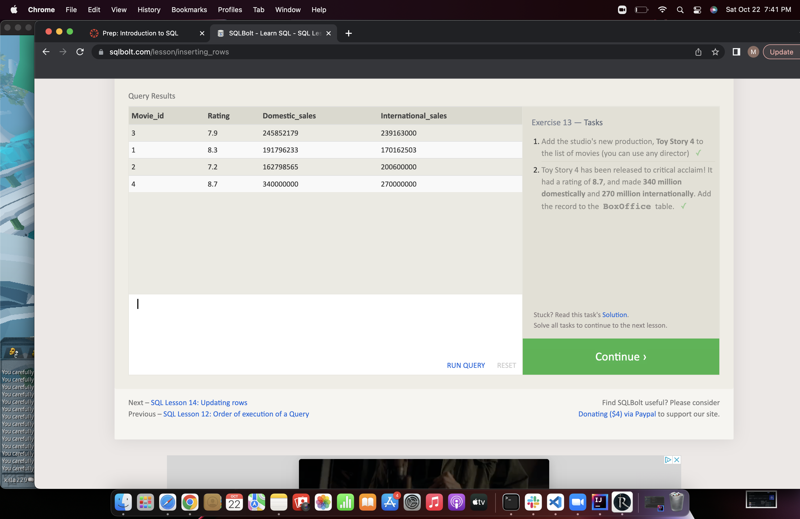
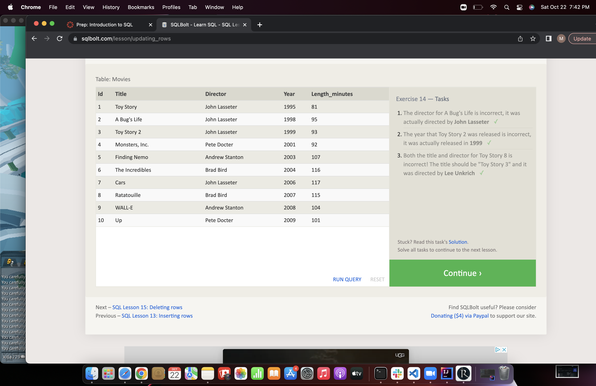
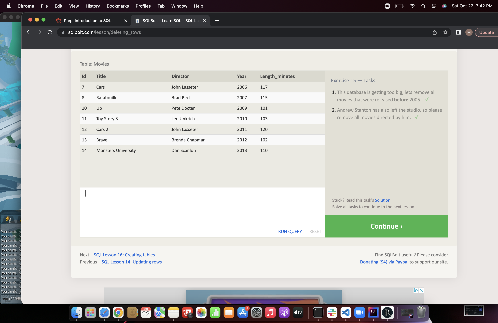
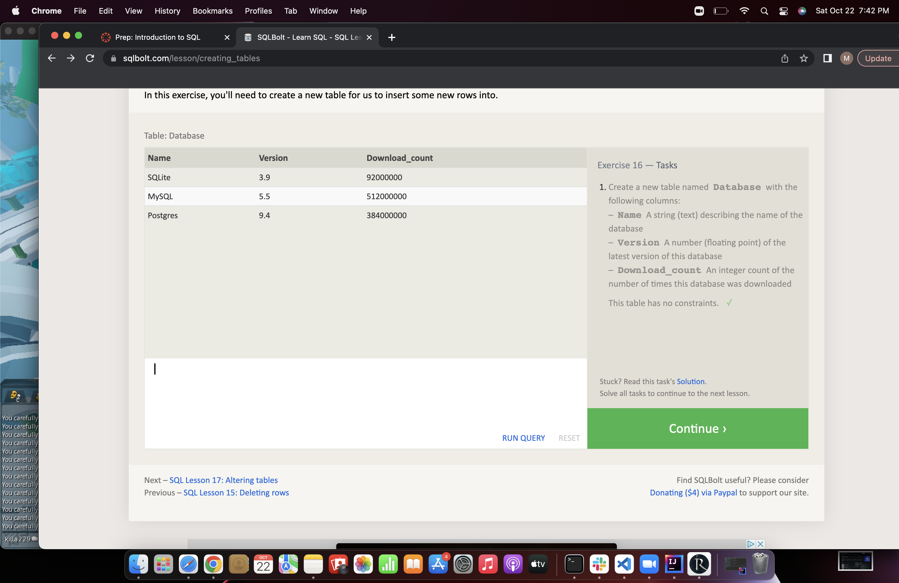
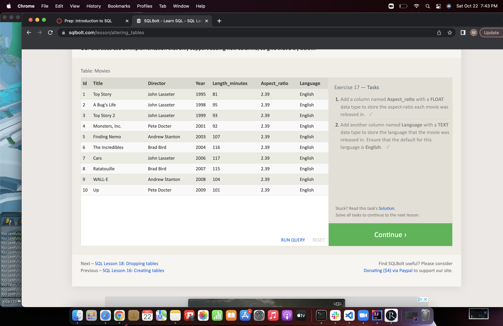
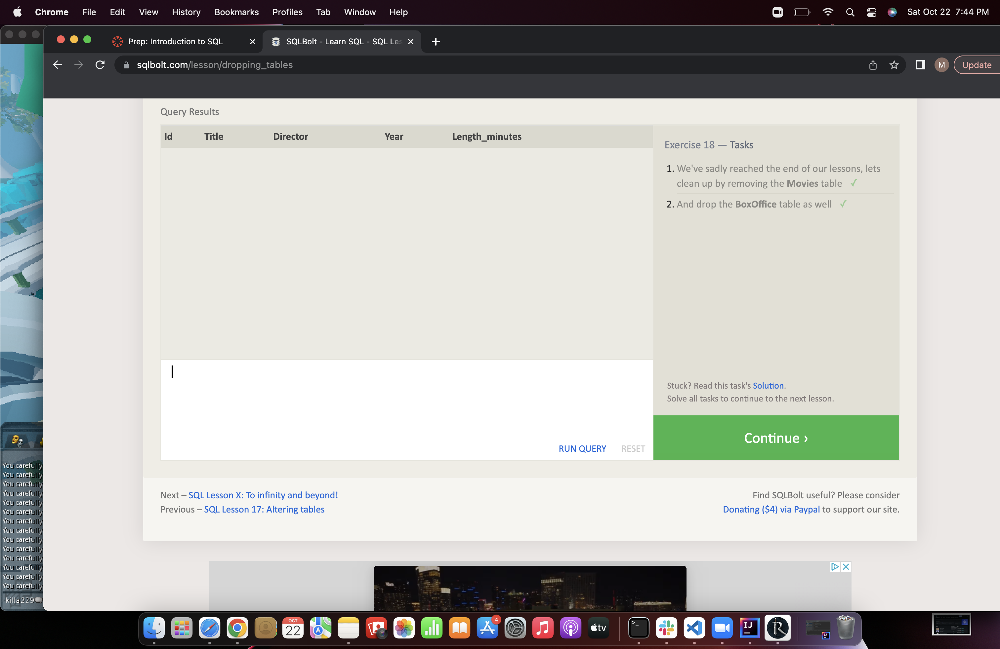

[If I'm curious about syntax click here](https://sqlbolt.com/lesson/dropping_tables)

## My main takeaway from this assignment was how amazing this source is for practicing and learning about syntax. Also about how theres selectors aailiable to extract the exact data you want and how easy it is to add data to an exisiting table ##
